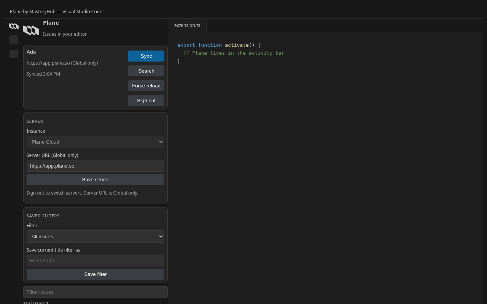
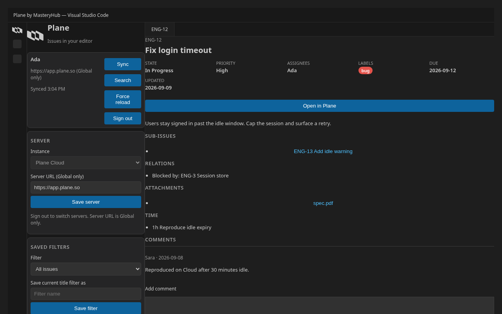
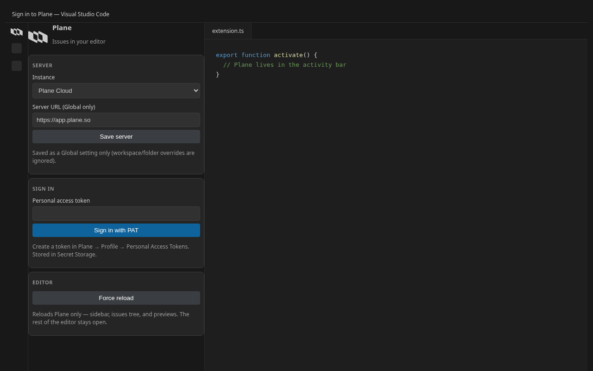

# Plane by MasteryHub ITS

[](./LICENSE)
[](https://github.com/masteryhub-its/plane-vscode-extension/actions/workflows/ci.yml)
[](https://github.com/masteryhub-its/plane-vscode-extension/stargazers)

Browse, preview, search, and manage issues from **self-hosted Plane** or **Plane Cloud** without leaving VS Code or Cursor.

This is an open-source **[MasteryHub ITS](https://www.masteryhub-its.com)** client. It is **not** an official [Plane](https://github.com/makeplane/plane) product.

**Every shipped capability** is listed in [FEATURES.md](./FEATURES.md).

The sibling [AFFiNE VS Code client](https://github.com/masteryhub-its/affine-vscode-extension) uses the same standards.

## Screenshots







## Features

- Sign in with a Plane personal access token (PAT via `X-API-Key`), stored in Secret Storage bound to `plane.serverUrl`
- Sidebar webview plus **Issues** tree: my issues, workspace → project → state/cycle/module → issues
- Issue preview with sanitized HTML, comments (read/write), sub-issues, attachments, relations
- **Open in Plane** via system browser (`openExternal`, no iframe)
- Search, create, change state/assignee/priority/labels/title/description/due date
- Copy issue key or URL; archive; delete; subscribe
- Hover and link detection for `{IDENTIFIER}-{n}` keys and Plane URLs
- Force reload, sync, optional assigned-issue badge, status bar

## Install

**From a store** (after a GitHub Release has run `publish.yml`):

1. [Visual Studio Marketplace](https://marketplace.visualstudio.com/items?itemName=MasteryHubITS.plane) or [Open VSX](https://open-vsx.org/extension/MasteryHubITS/plane)
2. Search **Plane by MasteryHub** in the editor Extensions view (`MasteryHubITS.plane`)
3. Open the Plane icon in the activity bar, set the server if needed, and sign in with a PAT

**From a GitHub `.vsix`** (sideload, or until the store listing is live):

1. Download the `.vsix` from [Releases](https://github.com/masteryhub-its/plane-vscode-extension/releases), or run `npm run package` in this repo.
2. VS Code / Cursor: **Extensions → … → Install from VSIX…**
3. **Restart** the editor (Force reload does not load new extension JavaScript).
4. Open the Plane icon in the activity bar, set the server if needed, and sign in with a PAT.

Uninstall any older sideload before installing a new `.vsix`.

## Settings

| Key | Default |
| --- | --- |
| `plane.serverUrl` | `https://app.plane.so` |
| `plane.defaultWorkspaceSlug` | empty (optional; last-visited workspace from the API is used when the list endpoint is missing) |
| `plane.defaultProjectId` | empty (all projects) |
| `plane.showAssignedBadge` | `false` |

Use `https://app.plane.so` for Plane Cloud, or your self-hosted URL with no trailing slash. Create a PAT in Plane → Profile → Personal Access Tokens.

## Develop

```bash
npm install
npm run validate
```

Press **F5** for the Extension Development Host. `npm run screenshots` regenerates the Marketplace PNGs from the real sidebar and preview HTML.

## Security

See [SECURITY.md](./SECURITY.md). Tokens live in Secret Storage, never in settings.

## License

[MIT](./LICENSE) © MasteryHub ITS
